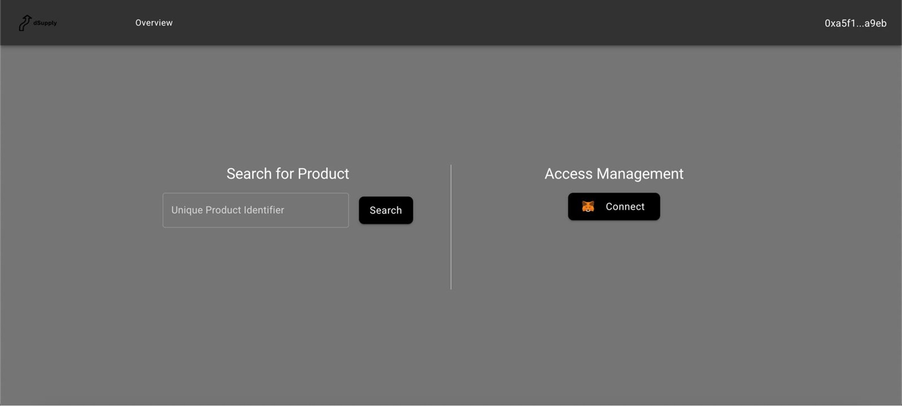
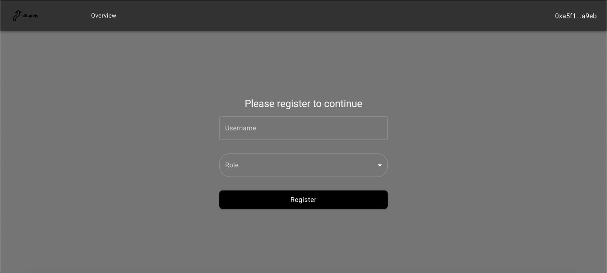
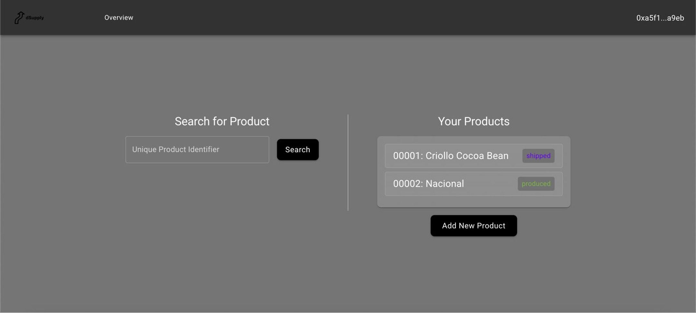
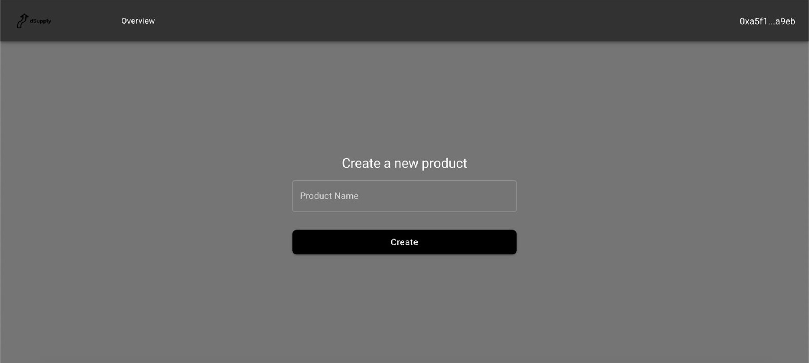
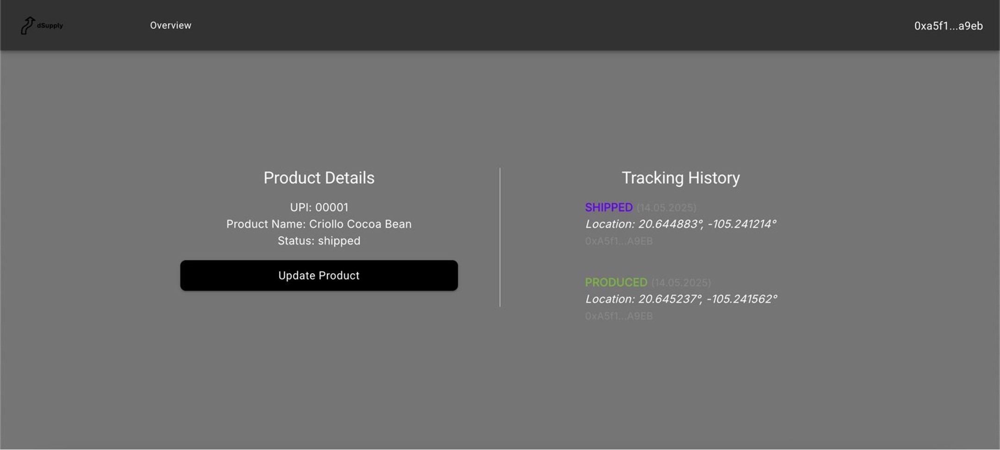
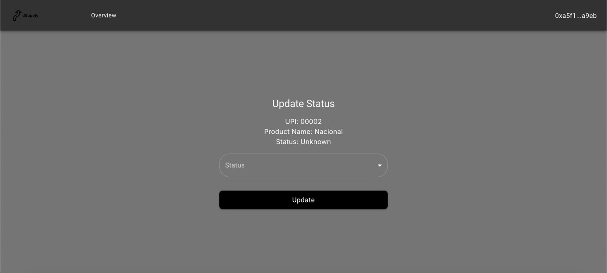

# Supply-Chain dApp

## Description

This is a decentralized application (dApp) for managing supply chains using blockchain technology. It allows users to track and verify the authenticity of products as they move through the supply chain, ensuring transparency and trust among all parties involved.

### Landing Page

The landing page provides two functionalities: product lookup and user login.



### Registration

A registered user will be automatically logged in when they connect their wallet. For new users, they can register by providing their details.



### Dashboard

The dashboard provides two functionalities: product lookup and an overview of the user's products.



### Product Creation

Users can create new products by providing the necessary details.



### Product Details

Users can view detailed information about a product, including its history and current status.



### Product Update

Users can update the status of a product as it moves through the supply chain.



## Setup/Installation

These instructions will get you a copy of the project up and running on your local machine for development and testing purposes.

### Clone

Firstly, you will need to clone this repository.

Open the "frontend" folder in your terminal, e.g.:

```bash
cd /path/to/folder/dApp
```

Tipp: in your IDE, you can right-click the folder and open it in an integrated terminal.

### Build (do only once at the beginning)

If this is your first time running the project or you have added some new code, run this:

```bash
npm install
```

and before doing that remove the following files/folders:

- package-lock.json
- node_modules

### Run

Finally, you can run the application using this command:

```bash
npm run dev
```

### View

Now, open your web browser (preferrably Google Chrome) and navigate to `http://localhost:3000` to view the application.

### Blockchain

To successfully interact with the blockchain, e.g. smart contracts, a user needs to use a wallet.

- Install the MetaMask plugin on Google Chrome.
- Create a wallet.
- Next, go to a Sepolia Faucet and ask for Test Token. (Note: You need 0.001 Ethereum funds in your wallet.)

### Stop

Press CTRL+C in the terminal to stop the application from running.

## Content

src: main folder. here, we do the work.

src/pages: here are the individual sites.

src/components: elements that are being reused across different pages.

src/contracts: smart contracts. these have to be deployed independently using Remix IDE.

src/hooks: here, we interact with the blockchain, e.g. smart contracts.

public: media/images that are being used in user interface.
